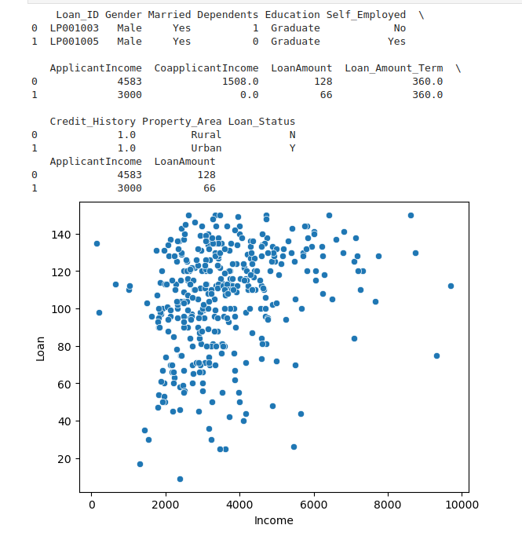

# Implementation of K-Means Clustering Algorithm
## Aim
To write a python program to implement K-Means Clustering Algorithm.
## Equipment’s required:
1.	Hardware – PCs
2.	Anaconda – Python 3.7 Installation

## Algorithm:

### Step1 : Import pandas.
<br>

### Step2 : Import matplotlib.pyplot.
<br>

### Step3 : Import sklearn.cluster from KMeans module.
<br>

### Step4 : Import seaborn Step5:Import warnings
<br>

### Step5 : Declare warnings.filerwarning with ignore as argument
<br>

### Step8:Declare a variable x2 as index of x1 with arguments ApplicantIncome and LoanAmount.
<br> 

### Step9:Display x1.head(2) and x2.head(2).
<br>

### Step10:Declare a variable x and store x2.values.
<br>

### Step11:Declare sns.scatterplot for ApplicantIncome and LoanAmount by indexing.
<br>

### Step12:Plot Income , Loan and display them.
<br>

### Step13:Declare a variable kmean = KMean(n_cluster_centers_) and execute kmean.fit(x).
<br>

### Step14:Display kmean.cluster)centers
<br>

### Step15:Display kmean.labels_ 
<br>

### Step16:Declare a variable predcited_class to kmean.predict([[]]) and give two arguments in it.
<br>

### Step17:Display the predicted_class
## Program:
```
Developed by: Kamalesh SV
register no: 22001133

import pandas as pd
import matplotlib.pyplot as plt
from sklearn.cluster import KMeans
import seaborn as sns
import warnings
warnings.filterwarnings('ignore')

data=pd.read_csv('clustering(1).csv')
print(data.head(2))

x1=data.loc[:,['ApplicantIncome','LoanAmount']]
print(x1.head(2))

X=x1.values
sns.scatterplot(X[:,0],X[:,1])
plt.xlabel('Income')
plt.ylabel('Loan')
plt.show()

Kmean=KMeans(n_clusters=4)
Kmean.fit(X)

print('Cluster Centers: ',Kmean.cluster_centers_)
print('Labels:',Kmean.labels_)

predicted_cluster=Kmean.predict([[9200,110]])
print('The clusters group for the Application 9200 and Loan Amount 110  is ',predicted_cluster)


```
## Output:




## Result
Thus the K-means clustering algorithm is implemented and predicted the cluster class using python program.